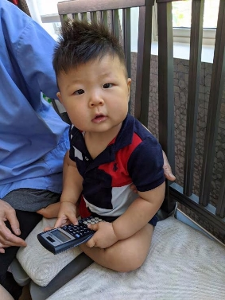
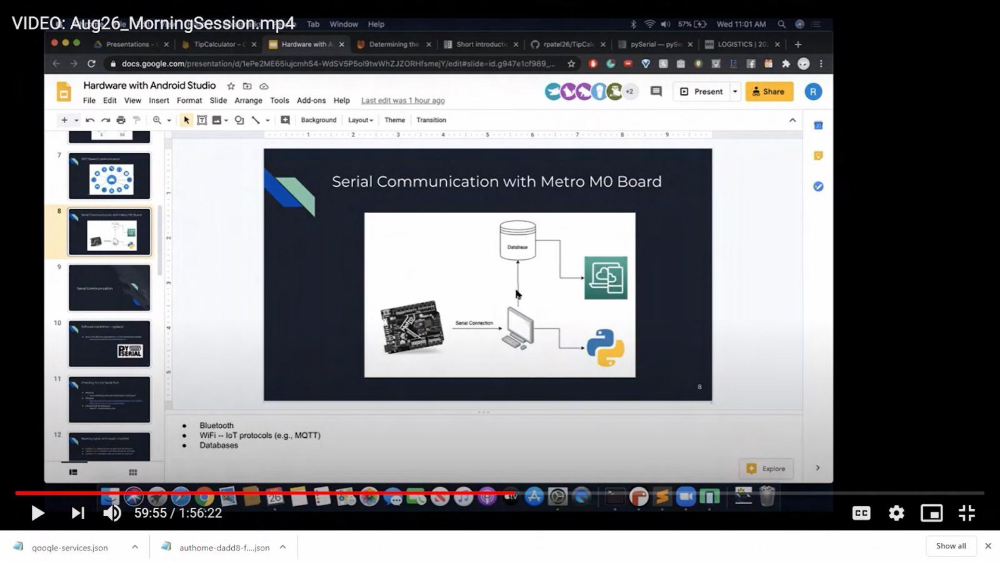
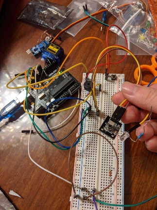
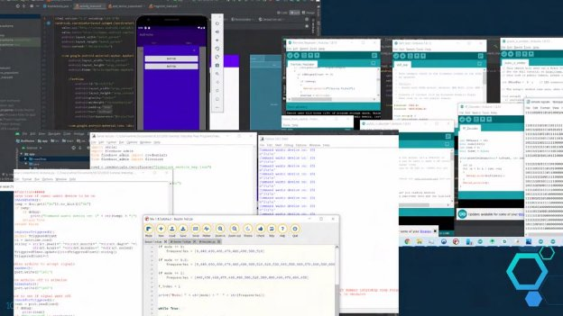

**AutoHome:   A   Home   Automation   System   Designed   for   Universal   Compatibility  with   Any   Hardware   Device** 

**Project   Report   for   UCSD’s   Summer   2020   Internship   Preparatory   Program *Jonathan   Xiong*** 

**Introduction:** 

My   project   was   to   build   a   home   automation   system   that   can   serve   as   the   framework   for any   device   to   be   connected   into   a   network   or   smart   home.   At   first,   my   project   idea   was   much simpler:   I   just   wanted   to   create   one   device.   That   device   is   a   Child   Proof   TV   Device   intended   for my   1   year   old   nephew   and   other   children.   But,   I   also   wanted   to   test   my   abilities   to   an   extreme within   the   project   development   week.   Imagining   all   the   possibilities   that   I   had   at   my   fingertips with   the   knowledge   base   grown   from   the   past   month   gave   me   the   idea   that   I   could   create   and improve   whatever   I   wanted   as   long   as   I   knew   the   general   idea   and   process,   so   that’s   what   I attempted:   implementing   everything   I   learned   for   the   best   project   I   could   make   in   a   week. Although   I   did   not   have   enough   time   to   implement   and   optimize   everything   I   wanted   to   within   a week   with   my   project,   I   still   managed   to   accomplish   plenty:   the   AutoHome   System   framework connected   to   the   original   device   I   wanted   to   create   for   my   nephew. 

**Conventional   TVs   Lacking   Child   Combination   of   Entertainment   and   Safety:** 

My   1   year   old   nephew   loves   pressing   buttons,   especially   when   something   magical happens,   such   as   something   turning   off   or   changing   from   a   distance.   TV   remotes,   having dozens   to   the   hundreds   of   buttons,   are   therefore   one   of   his   favorite   objects.   However,   TV remotes   turn   on   a   TV   screen,   which   commonly   has   fast,   flashing   lights.   According   to   popular studies,   fast   and   flashing   lights   cause   ADHD   among   children,   a   condition   my   sister   and brother-in-law   doesn’t   want   to   risk   developing.   So,   we   were   stuck   with   options   along   the   lines   of taking   away   the   remote   or   moving   around   batteries   multiple   times   a   day   to   prevent   the   TV   from turning   on   at   all.   These   sorts   of   options   took   away   part   of   the   experience   that   made   him   enjoy the   TV   remote,   more   than   even   his   blankie  

sometimes.   So,   to   prevent   that   tragedy,   I   wanted   to  

make   something   that   was   automatic   or   easy   to   use,  

prevented   ADHD,   and   allowed   my   nephew   to   enjoy  

pressing   buttons   as   much   as   before.  

**Child   Proof   TV   Device:**  

To   fulfill   the   conditions,   I   came   up   with   a  device   that   could   automatically   turn   the   TV   off   after  it   was   turned   on.   The   device   would   be   placed   under  or   above   the   TV.   It   would   read   the   infrared   signals  that   are   sent   to   the   TV   by   the   remote,   such   as   an   on signal,   decode   the   signal,   then   encode   an   off   signal and   send   it   to   the   TV,   effectively   turning   the   TV   off after   the   TV   remote   turns   the   TV   on.   This   Child Proof   TV   Device   met   all   the   conditions   set   for   it:   it’s 

actions   are   automatic   once   on,   gave   my   nephew   the   satisfaction   of   seeing   something   turn   on from   a   distance   after   pushing   a   button,   and   turned   off   the   TV   soon   enough   for   no   images   and flashing   colors   to   display   yet.  

However,   in   consideration   of   my   urge   to   improve   upon   its   usability   and   urge   to   put   my abilities   to   the   test,   I   didn’t   want   to   stop   with   just   a   secluded   device   in   our   age   of   connectivity. Some   other   conditions   I   wanted   to   meet   were   arming   and   disarming   the   device    at   a   distance, like   from   on   the   couch   or   even   when   at   work   and   your   child   calls   asking   to   enjoy   the   TV   for   a   bit after   finishing   homework.  

**AutHome   System:** 

AutoHome   System   would   be   a   home   automation   system   that   provides   the   framework   for devices   to   connect,   interact,   and   form   a   smart-home.   Every   device,   such   as   the   Child   Proof   TV Device,   at   one’s   home   can   connect   to   a   hub.   This   hub   would   also   be   connected   to   the   wifi, allowing   access   to   the   rest   of   the   internet.   Therefore,   the   hub   would   be   the   intermediary between   every   device   and   the   rest   of   the   internet.   One   service   the   hub   would   be   connected   to over   the   internet   is   an   online   database   for   storing   and   receiving   of   more   permanent   information. The   physical   hub   would   be   more   purposed   towards   processing   information,   instead   of   storing, also   decreasing   hub   size   in   a   home.  

The   user   sets   up   the   physical   hardware,   having   no   need   to   worry   about   any   software developing.   The   user   just   needs   to   install   an   app   on   their   phone   and   configure   their   desired settings   to   optimize   their   interaction   with   the   AutoHome   System.   The   phone   would   be   able   to interact   with   the   online   database,   retrieving   saved   information.   For   interacting   with   devices, using   the   app,   the   user   would   interact   with   the   hub   over   the   internet   for   purposes   such   as turning   on   and   off   a   device   from   afar. 

**Prototype   Plan:**  

In   developing   the   prototype,   because   there   was   a   lot   that   needed   to   be   done,   I   had   some practices   and   methods   of   development   I   tried   following.   I   had   a   plan   to   work   on   AutHome starting   from   each   end   of   the   system’s   connections.   For   example,   I   started   developing   the hardware   side   and   app   side   first.   I   then   iteratively   developed   everything   in   between,   which although   was   slow,   was   effective   in   preventing   bugs,   thus   saving   lots   of   time   during   debugging. Step   by   step,   I   worked   towards   the   middle   where   everything   connects,   in   this   case,   that   was   the hub.   So,   from   the   hardware   side,   the   next   step   was   connecting   to   and   communicating   with   the hub.   From   the   app   side,   this   was   connecting   to   the   online   database,   then   from   database   to   hub.  

**Prototyping-   Hardware   Side** 

At   first,   I   tried   using   only   hardware   and   software   from   our   program,   such   as   the   Adafruit Metro   M0   Express   board   and   Flying   Fish   FC-51   IR   Sensor.   This   module   is   designed   for proximity   detection   only:   it   has   an   IR   LED   emitter   and   receiver,   continuously   emitting   and attempting   to   receive   an   IR   signal,   which   would   signify   an   object   in   front   that   is   reflecting   the   IR 

waves   back.   I   thought   this   module   was   pretty   cool and   that   maybe   I   could   use   it   for   receiving   and sending   TV   IR   waves   with   software   solutions repurposing   the   hardware,   separating   the   emitter’s 

control   and   sensor’s   input.   I   managed   to   separate   the emitter   and   sensor   controls   through   specific   software controls,   but   ran   into   great   difficulty   with   receiving, decoding,   encoding,   then   emitting   a   signal.  

`           `For   the   first   two   of   the   four   days   of   project development,   I   tried   getting   the   board   to   receive   a signal,   decode   it,   encode   another,   and   send   it accurately   enough   for   the   television   to   recognize   it. However,   I   eventually   found   out   through   lots   of experimenting   and   researching   that   there   lied problems   with   hardware   that   made   this   task 

impossible   using   hardware   provided   by   the   program. The   main   reason   was   that   TVs   only   recognize   IR signals   that   pulse   at   around   38,500   Hz.   This   design specification   was   to   not   receive   interference   from 

other   household   devices   such   as   lamps   that   typically   emit   weak   IR   signals   at   60   Hz   in   the   US. Adafruit’s   Metro   M0   Express   board’s   internal   frequency   and   CPU   were   not   fast   enough   to handle   oscillations   that   fast   (The   Metro   M0   Express   configuration   I   used   is   shown   in   the   picture above).   Luckily,   I   worked   with   an   Arduino   UNO   R3   board   before   and   found   out   that   it   had   the necessary   specifications   to   process   signals   at   speeds   far   greater   than   38,500   Hz,   so   I   moved my   modules   onto   my   Arduino   board.  

I   spent   another   half   day   refactoring   my   code   from   CircuitPython   to   Arduino   C,   eventually finding   out   that   Flying   Fish’s   FC-51   module   was   also   not   good   enough   to   clearly   send   and process   signals   at   38,500   Hz.   I   should’ve  expected   that   sooner   as   I   tried   drastically  repurposing   the   module’s   functionally,  similar   to   what   Boeing   did   for   the   737   Max  8,   just   not   on   the   same   scale.   Luckily   again,  my   Arduino   kit   from   years   ago   had   an   IR  Sensor   module   with   greater   sensitivity   which  allowed   me   to   get   the   designed   device  working.   But,   I   did   not   have   a   good   IR   LED  emitter,   so   I   took   apart   some   old   remotes  and   scavenged   their   IR   emitter   to   hack   it  onto   my   device.   This   process   took   another  half   day,   using   simple   machine   learning   to  receive,   decode,   encode,   and   send   IR  signals   of   38,500   Hz   (The   Arduino   Setup   is  to   the   right).   I   also   added   a   button   for  debugging   purposes   and   a   Piezzo   Buzzer  as   an   alarm.   3   days   had   now   passed   and   I  was   in   major   panic   mode   to   try   to   achieve  basic   functionality   in   1   day.  

**Prototyping-   Software   Side** 

I   had   very   little   experience 

developing   in   Android   Studio   SDK.   The   one   time   I   tried,   I   experienced   a   very   challenging   task   of coding   with   xml   files   and   I   had   many   issues   with   version   control.   These   are   both   issues   I   ran into   again   when   trying   to   implement   the   app   interface   of   AutHome,   however,   Android   Studios now   has   a   decent   graphical   design   option   which   streamlined   a   lot   of   the   UI   development.  

For   the   app’s   design,   I   wanted   it   to   have   two   tabs:   one   containing   all   the   devices   and   the other   containing   information   reports, such   as   one   for   if   someone   tried turning   on   the   TV   when   the   Child Proof   Tv   Device   was   armed, 

including   the   time   attempted.   I   started writing   the   backend   for   this   portion, 

but   I   didn’t   have   enough   time   to   finish implementing.   I   also   had   an   add device   button   that   opens   a   Dialog   to input   information   regarding   the device,   however,   I   also   didn’t   have enough   time   designing   this.   In   the 

end,   I   had   barely   enough   time   to   have   basic   functionalities   to   communicate   with   the   Child   Proof TV   Device.  

Regarding   my   run-ins   with   version   control   this   time:   I   spent   a   couple   hours   rewriting   my code   in   different   min   SDK   versions.   I   changed   from   version   14   to   30   to   29   to   26.1   then   back down   to   16.   The   issue   was   when   I   tried   running   my   code,   some   dependencies   would   be   error prone   and   I   couldn’t   run   it.   I   eventually   settled   with   version   16   because   I   could   still   use   it   for connecting   to   Google’s   Firestore   database   and   it   managed   to   work   after   adding   a   few   extra   files and   dependencies   I   tried   from   others   who   I   found   to   have   trouble   from   online.   Although   I   had less   time   to   develop   AutHome,   I   learned   a   lot   more   about   Android   Studio’s   development   in   the process. 

**Prototyping-   Connecting   Everything   to   Hub:** 

I   used   my   laptop   as   the   hub   in   my   prototype.   There   were   some   differences   in   how   I implemented   my   hub   versus   how   I   wanted   to   design   it.   For   example,   I   wanted   to   have   a   wireless connection   to   my   Child   Proof   TV   Device,   however,   there   was   no   luck   this   time   in   having   a   WiFi or   bluetooth   module   that   came   with   my   Arduino.   So,   I   established   a   serial   connection   between my   laptop   and   the   Child   Proof   TV   Device.   Arduino   was   very   specific   in   how   it   liked   to   read   what was   sent   to   it   serially,   so   took   a   little   bit   to   figure   out.   The   way   I   implemented   it   required   my   hub, programmed   in   Python,   to   send   bytes   according   to   ASCII   code   and   I   could   only   get   Arduino   to read   what   was   sent   by   the   hub   consistently   by   reading   byte   by   byte. 

On   the   other   side,   connecting   my   hub   to   my   app   was   quite   simple.   I   didn’t   run   into   many problems   on   this   side   as   I   could   send   and   retrieve   data   from   Google   Firestore   using   very   well established   procedures   and   functions.   Overall,   connecting   everything   was   quite   easy   compared to   many   other   parts   of   AutHome.   It   was   also   surprisingly   clear   and   straightforward   because   all that   I   needed   to   connect   was   modular. 

**AutHome   and   Child   Proof   Drive   Quick   Demonstration <https://photos.app.goo.gl/Gbjst4TmgeSamHsg6>** 

**Conclusion:** 

The   most   memorable   theme   of   this   project   was   how   much   I   tried   implementing.   I   set   very high   expectations   of   what   I   wanted   to   do   for   this   project:   implementing   something   related   to every   topic   we   learned   in   this   program,   such   as   Android   Development   SDK   in   Java   and   xml, Arduino   in   C,   Google   Firestore   Database,   Python,   and   simple   machine   learning.   The   time constraint,   which   I   was   constantly   reminded   of   and   pressured   from,   allowed   me   to   try   to   work   as fast   and   efficiently   as   possible.   I   still   ran   into   a   lot   of   problems,   especially   in   the   beginning,   as   I wasn’t   very   familiar   with   everything   I’ve   learned   during   this   program,   yet.   However,   even   topics I’ve   learned   from   my   courses,   such   as   Python,   Java,   and   C,   were   becoming   confused   in   my head,   as   I   had   to   switch   between   these   languages   for   different   sections   of   AutoHome,   leading me   to   sometimes   write   Python   for   Arduino   or   C   for   Android   Studios.   This   was   probably   the biggest   software   project   I’ve   done   and   I’ve   learned   so   much   in   my   struggles.   I   would   definitely go   through   the   process   again   if   it   meant   I   could   learn   more.   Although   I   didn’t   meet   my expectations   for   accomplishing   this   project,   I   aimed   so   very,   very   high   that   I   still   shot   quite   high and   managed   to   get   a   decent   AutHome   prototype   working.  

For   the   future   of   AutHome,   I   would   definitely   spend   more   time   on   designing   the   app’s   UI in   terms   of   looks   and   functionality.   Also,   I’d   get   better   sensors   and   modules   for   better   user experience   with   their   devices   not   glitching   and   acting   slow.   Considering   a   system   requires multiple   entities,   to   make   AutHome   more   true   to   that   definition,   I’d   make   more   devices compatible   and   add   many   more   devices   to   AutHome.   Lastly,   it’ll   be   nice   if   there   weren't   loose wires   hanging   around,   so   I’d   also   want   to   try   our   EagleCad   for   PCB   design   and   CAD   for   3D printed   cases   for   each   device. 

**References:** 

1. <https://drive.google.com/drive/folders/1gAjlShVl9Yt9pUCpyZAAYje_YN1K5kzP> 
1. <https://www.instructables.com/id/Arduino-Python-Communication-via-USB/> 
1. <https://www.instructables.com/id/How-to-control-your-TV-with-an-Arduino/>  
1. <http://www.arrl.org/files/file/ETP/TV%20remote%20decoder%20kit%20ver%202_2.pdf>  
1. <https://www.instructables.com/id/Control-LED-Using-Serial-Monitor/>  
1. <https://www.youtube.com/watch?v=0DH2tZjJtm0>  
